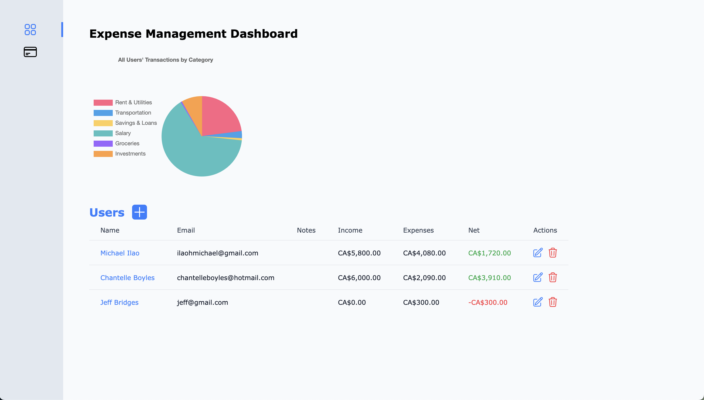

# Expense Management Dashboard

Take home assessment for PSPS, build an Expense Management Dashboard for user registration, transaction tracking, and data
visualization.



## Development

There are 3 components to this System

- Go Backend API
- MongoDB Database
- React Frontent App

To begin development start by copying `sample.env` to `.env` and making a copy of `.env` in `fe` and `be`

OR

```bash
chmod +x copy-env.sh
./copy-env.sh
```

To run the database

```bash
docker-compose up -d mongo

# To stop
docker-compose stop mongo
```

To run the backend

```bash
cd be
make run
```

To run the frontend

```bash
cd fe
npm install
npm run dev
```

## Deploy

To run all services in a production/testing environment

```bash
docker compose up --build
```
